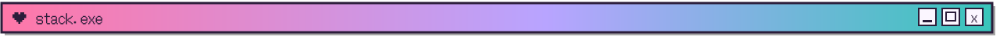
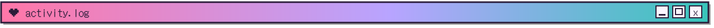

<p align="center">
  <a href="https://styx.cash">
    
  </a>
</p>

<p align="center">
  <a href="https://styx.cash"></a>
  <a href="https://x.com/Styx_PQ"></a>
  <a href="https://x.com/Slashy_fx"></a>
  <a href="mailto:amirramy.chatbi@gmail.com"></a>
</p>


```console
$ whoami
slashy :: founder @ styx

$ cat ~/styx/README
Pay anyone on Solana, any amount.
The amount stays hidden. So does your wallet.

$ styx status
network ...... solana devnet
proofs ....... hash-based STARK, verified on chain by a Solana program
payments ..... sent by a relayer: your wallet never signs them
audit ........ pending, before mainnet
```

<table>
  <tr>
    <td valign="top" width="50%">

**今 :: now**
- Shipping Styx v2: any amount, payment links, discreet sends
- Hardening the relayer so nobody can drain it, even on purpose
- Measuring everything, publishing only what is measured

</td>
    <td valign="top" width="50%">

**次 :: next**
- A merchant kit: checkout button and server-side confirmation
- A leaner mainnet launch budget
- An external audit before real money

</td>
  </tr>
</table>



<p align="center">
  
  <br/>
  
</p>

<p align="center">
  
  
  
  
  
</p>


<p align="center">I draw anime illustrations. Some of them end up in the Styx visuals.</p>

<!-- Drop an illustration here, for example: <p align="center"></p> -->



<p align="center">
  <picture>
    <source media="(prefers-color-scheme: dark)" srcset="https://raw.githubusercontent.com/IsSlashy/IsSlashy/output/snake-dark.svg"/>
    <source media="(prefers-color-scheme: light)" srcset="https://raw.githubusercontent.com/IsSlashy/IsSlashy/output/snake.svg"/>
    
  </picture>
</p>

<p align="center"><sub>Most of my work lives in private repos, so the public graph undersells it.</sub></p>

<p align="center">
  
</p>

<p align="center"><sub>Privacy is necessary for an open society in the electronic age (Eric Hughes, A Cypherpunk's Manifesto, 1993). Pixel glyphs drawn from DotGothic16 (SIL Open Font License).</sub></p>
